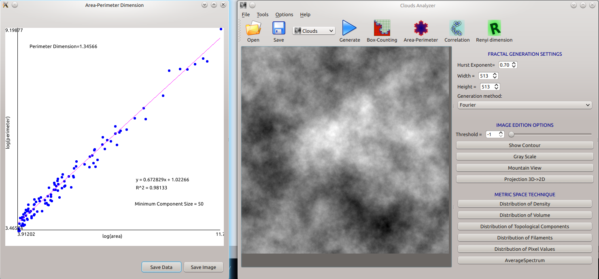
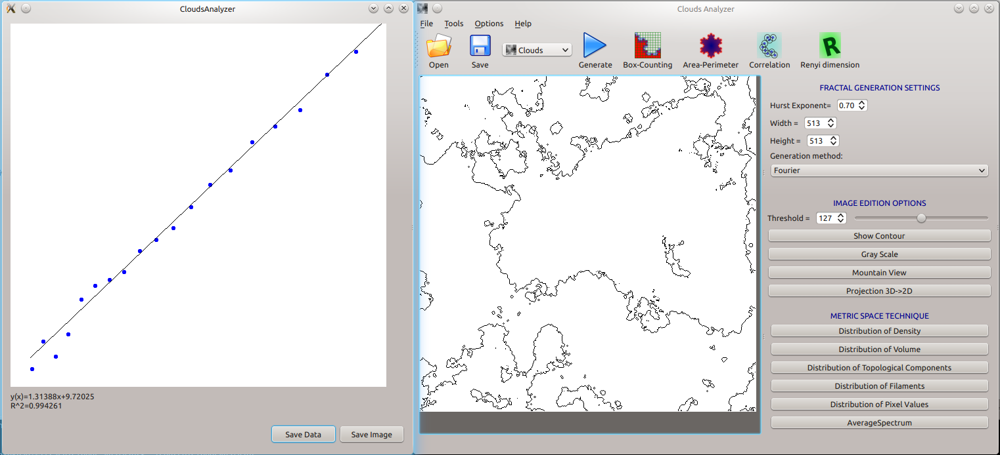

Introduction
============

Do you have a picture and want to know if it is a fractal?
We might be able to help.

Clouds Analyzer is a graphical computer program that simulates clouds and tries to measure different properties of these clouds.

It started up as a tool to test if certain physical processes are happening in the interstellar medium, the sites of start creation. It is thus linked to big words such as turbulence...

But you can use it for simpler stuff too, I think.

What can I do
=============

1) Create some very basic fractals
  * koch curve
  * Hennon attractor
  * Fractional browmian motion in 1 Dim
  * Molecular clouds.

2) Measure fractal dimensions of these fractals:
  * Box counting dimension
  * Correlation dimension
  * Rengy dimensions
  * Area-perimeter dimension.

3) Load some images (2D) and make some analysis on those images:
  * Convert the color image to a grey scale image
  * Make it black and white with a particular threshold
  * Detect borders
  * Measure fractal dimensions of this image

Build instructions
=================

In any Linux system, just change to the source directory and

* `qmake`
* `make`

Dependencies:

* Qt4
* FFTW3 (sudo apt-get install libfftw3-dev on my linux box)

Images
======
A generated cloud with its Area-Perimeter dimension:

The same cloud, computing the box-counting dimension of the "border" of the cloud:

CREDITS
=======

This program started as part of the thesis of Sandra Ocando and is now maintained by N. Hatcher. If there is something hat interest you here please contact me.
